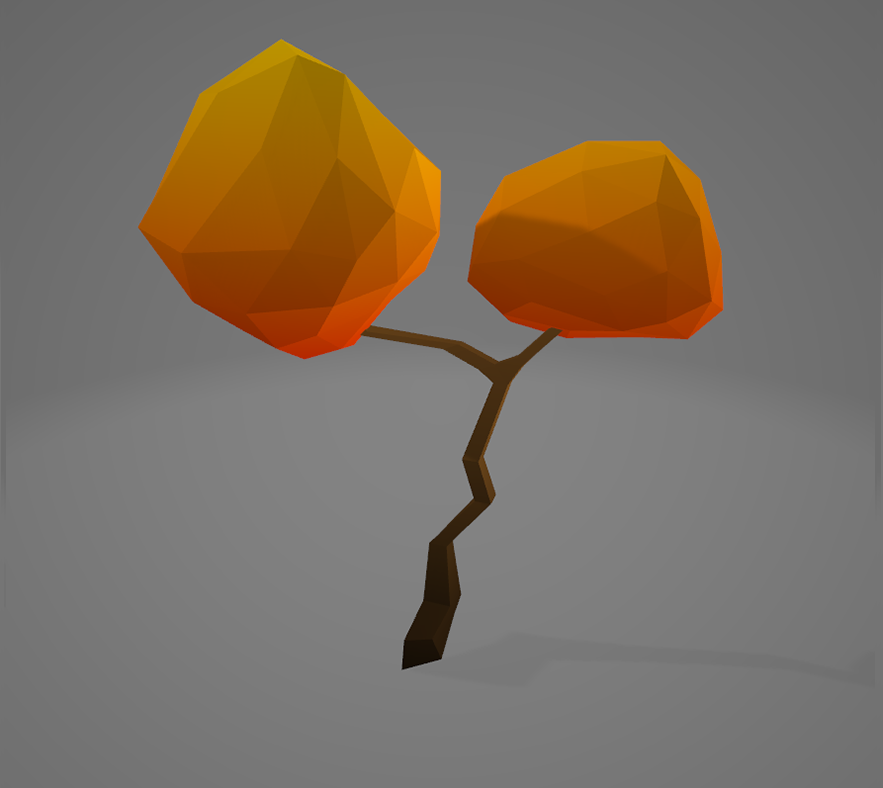
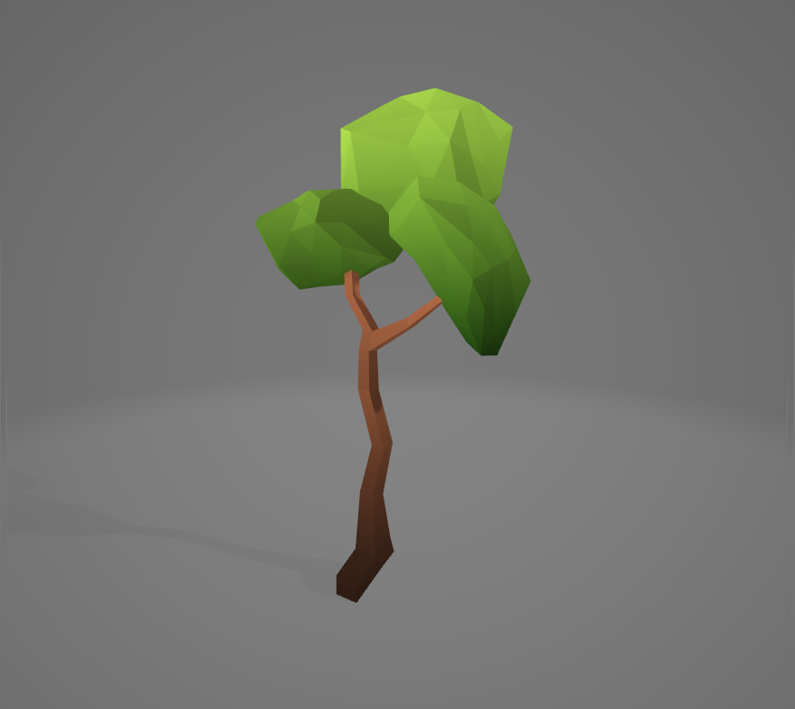

# game-Environment
   
Low poly 3d game environment made using blender. 2020

Some low poly game environment I made for my game in 2020. It inclueds bushes, coins, grass, crate, rock, tiles and trees.

 ## Project description
Name: game-Environment  
Software: Blender 
platform: 3D  
Project No: Update me  
Year: 2020

## Screen shot

### Bushes
    

### Coins
    

### Grass
     
      

### Crate

### Rock

### Tiles
     
      

### Trees
     
      

## 3D file

### bushes
* **[bush1](https://github.com/XAbirHasan/game-Environment/blob/master/3d/bush/bush1.fbx)**
* **[bush1](https://github.com/XAbirHasan/game-Environment/blob/master/3d/bush/bush2.fbx)**

### Coins
* **[Coin](https://github.com/XAbirHasan/game-Environment/blob/master/3d/coin/Coin1.fbx)**
* **[Coin2](https://github.com/XAbirHasan/game-Environment/blob/master/3d/coin/Coin2.fbx)**

### Grass
* **[grass1](https://github.com/XAbirHasan/game-Environment/blob/master/3d/grass/grass1.fbx)**
* **[grass2](https://github.com/XAbirHasan/game-Environment/blob/master/3d/grass/grass2.fbx)**
* **[grassPlate1](https://github.com/XAbirHasan/game-Environment/blob/master/3d/grass/grassPlate1.fbx)**
* **[grassPlate2](https://github.com/XAbirHasan/game-Environment/blob/master/3d/grass/grassPlate2.fbx)**
* **[grassPlate3](https://github.com/XAbirHasan/game-Environment/blob/master/3d/grass/grassPlate3.fbx)**

### Crate
* **[Crate](https://github.com/XAbirHasan/game-Environment/blob/master/3d/tile/crate.fbx)**

### Rock
* **[rock](https://github.com/XAbirHasan/game-Environment/blob/master/3d/tile/rock.fbx)**

### Tiles
* **[tileDirt1](https://github.com/XAbirHasan/game-Environment/blob/master/3d/tile/tileDirt1.fbx)**
* **[tileDirt2](https://github.com/XAbirHasan/game-Environment/blob/master/3d/tile/tileDirt2.fbx)**
* **[tileDirt3](https://github.com/XAbirHasan/game-Environment/blob/master/3d/tile/tileDirt3.fbx)**
* **[tileStone1](https://github.com/XAbirHasan/game-Environment/blob/master/3d/tile/tileStone1.fbx)**
* **[tileStone2](https://github.com/XAbirHasan/game-Environment/blob/master/3d/tile/tileStone2.fbx)**

### Trees
* **[Tree1](https://github.com/XAbirHasan/game-Environment/blob/master/3d/tree/Tree1.fbx)**
* **[Tree2](https://github.com/XAbirHasan/game-Environment/blob/master/3d/tree/Tree2.fbx)**
* **[Tree3](https://github.com/XAbirHasan/game-Environment/blob/master/3d/tree/Tree3.fbx)**
* **[Tree4](https://github.com/XAbirHasan/game-Environment/blob/master/3d/tree/Tree4.fbx)**
* **[Tree5](https://github.com/XAbirHasan/game-Environment/blob/master/3d/tree/Tree5.fbx)**

## Authors

* **AbirHasan**

Check out my other works [@XAbirHasan](https://github.com/XAbirHasan)
