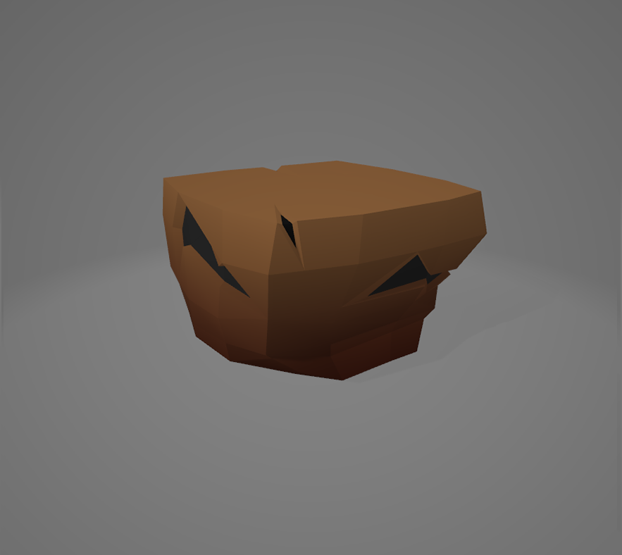
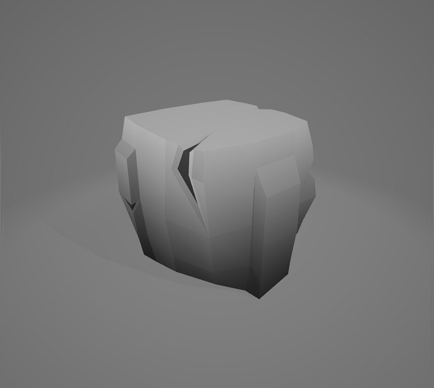
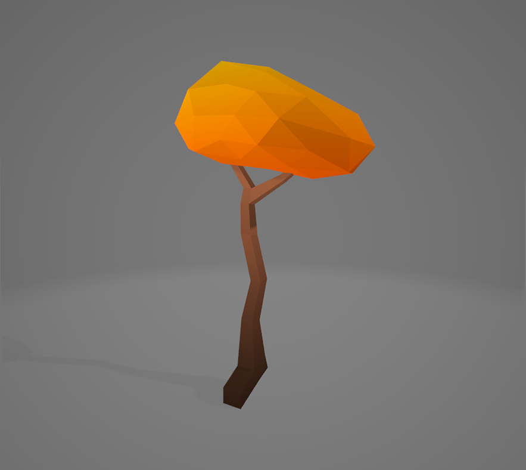
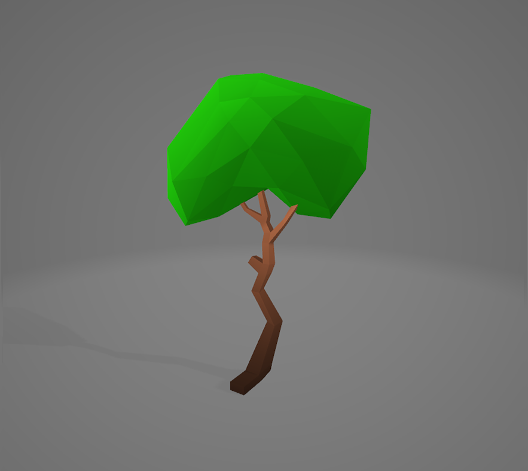

# game-Environment
   
Low poly 3d game environment made using blender. 2020

Some low poly game environment I made for my game in 2020. It inclueds bushes, coins, grass, crate, rock, tiles and trees.

 ## Project description
Name: game-Environment  
Software: Blender 
platform: 3D  
Project No: Update me  
Year: 2020

## Screen shot

### Bushes
    

### Coins
    

### Grass
     
      

### Crate

### Rock

### Tiles
     
      

### Trees
     
      

## 3D file

### bushes
* **[bush1]()**
* **[bush1]()**

### Coins
* **[Coin]()**
* **[Coin2]()**

### Grass
* **[grass1]()**
* **[grassD2]()**
* **[grassPlate1]()**
* **[grassPlate2]()**
* **[grassPlate3]()**

### Crate
* **[Crate]()**

### Rock
* **[rock]()**

### Tiles
* **[tileDirt1]()**
* **[tileDirt2]()**
* **[tileDirt3]()**
* **[tileStone1]()**
* **[tileStone2]()**

### Trees
* **[Tree1]()**
* **[Tree2]()**
* **[Tree3]()**
* **[Tree4]()**
* **[Tree5]()**

## Authors

* **AbirHasan**

Check out my other works [@XAbirHasan](https://github.com/XAbirHasan)
